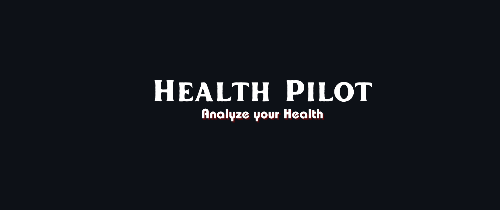

<br>


<BR>


<br>


<br><br>

## 🗒️ Table of Contents

- [What is Health Pilot?](#-what-is-health-pilot)
- [Features](#-features)
- [Integrating Google Sheets](#%EF%B8%8F-integrating-google-sheets)
- [Installation](#-installation)
- [Run Application](#%EF%B8%8F-run-application)
- [How to Use](#-how-to-use)
- [Made By](#-made-by)
<br>

## ⭐ What is Health Pilot?

Welcome to Health Pilot. Your virtual co-pilot for a healthier you! It is a Diabetes Prediction System. This platform is designed to predict and analyze diabetes using trained machine learning models. Our platform leverages machine learning models to provide accurate predictions based on the data you input. You can store previously entered reports and analyze your diabetes health over time. This feature allows you to track changes in your health parameters and make informed decisions.
<br><br>

## 🤓 Features

- Quick and accurate disease predictions.
- Experience a seamless and user-friendly interface designed to simplify your health journey.
- Safely store and manage your previous health reports, creating a comprehensive archive for easy reference and tracking.
- Google Sheets integration for data storage.
- Data visualization for analysis.
<br><br><br>


## 🗄️ Integrating Google sheets
This applications uses Google Sheets as a data storage solution. Connected Health Pilot with google sheets with the help of Google Sheets API which is available on Google Cloud. The below are the steps followed to acheive the connection with google sheets:
- Create a new project on Google Cloud and enable the Google Sheets API.
- Create API credential and generate its JSON key file.
- Create a new google sheet and give the 'client email' from json key file the editor access.
- Now, install the required Python libraries in the project to establish the connection:<br><br>
  gspread, google-auth, google-auth-oauthlib and google-auth-httplib2
    
    ```bash
    pip install gspread google-auth google-auth-oauthlib google-auth-httplib2
    
    ```

    <br><br>


## 🔨 Installation

Before running the application, ensure you have the following installed on your machine:<br><br>


<br>

- Streamlit
    
    ```bash
    pip install streamlit
    
    ```
    
- Plotly
    
    ```bash
    pip install plotly
    
    ```
    
- Streamlit Option Menu
    
    ```bash
    pip install streamlit-option-menu
    
    ```
<br>

## 🏃‍♀️ Run Application

Clone the project

```bash
  git clone https://github.com/Ayesha-Siddiqua88/Health-Pilot.git

```

Go to the project directory

```bash
  cd my-project

```

Run the following code in terminal

```bash
  streamlit run Pages/Analyser.py

```

<br>

## 🤔 How to Use

1. **Data Entry:**
    - Fill in the required information for the diabetes disease prediction.
    - Click the 'Diabetes Test Result' prediction button to get the result.
3. **View Results:**
    - View the prediction result and relevant information.
    - Explore additional analysis and visualizations available.

<br>

## 🎥


<br>

## 💙 Made by
Ayesha and Sana
